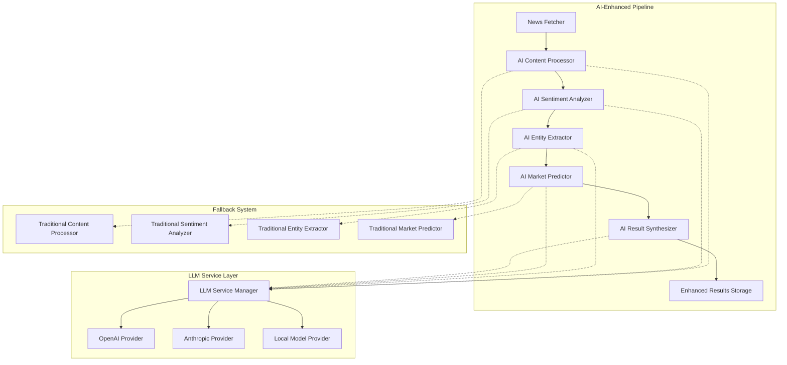

# Design Document: AI-Enhanced Pipeline

## Overview

The AI-Enhanced Pipeline extends the existing news market predictor system by integrating Large Language Model (LLM) capabilities at each major processing stage. This design maintains backward compatibility with the existing system while adding sophisticated AI-powered analysis, reasoning, and insight generation.

The enhanced pipeline follows the same core workflow as the existing system but augments each step with LLM capabilities:
1. **News Fetching** (unchanged) → **AI-Enhanced Content Processing**
2. **AI-Enhanced Sentiment Analysis** → **AI-Enhanced Entity Extraction** 
3. **AI-Enhanced Market Prediction** → **AI-Powered Result Synthesis**

## Architecture

### High-Level Architecture



### Component Integration Strategy

The AI-enhanced components extend existing interfaces while maintaining full backward compatibility:

- **Decorator Pattern**: AI components wrap existing implementations
- **Fallback Mechanism**: Automatic fallback to traditional methods on AI failure
- **Configuration-Driven**: AI features can be enabled/disabled per component
- **Gradual Enhancement**: Components can use AI for specific tasks while maintaining existing functionality

## Components and Interfaces

### 1. LLM Service Layer

#### LLMService Interface
```python
class LLMService(ABC):
    @abstractmethod
    def generate_completion(self, prompt: str, model: str = None, **kwargs) -> LLMResponse
    
    @abstractmethod
    def generate_structured_output(self, prompt: str, schema: Dict, **kwargs) -> Dict[str, Any]
    
    @abstractmethod
    def is_available(self) -> bool
    
    @abstractmethod
    def get_usage_stats(self) -> Dict[str, Any]
```

#### LLMServiceManager
- **Purpose**: Manages multiple LLM providers with load balancing and fallback
- **Providers**: OpenAI, Anthropic, Local Models (Ollama, etc.)
- **Features**: Rate limiting, cost tracking, provider selection, circuit breaker pattern
- **Configuration**: Provider priorities, model selection, timeout settings

#### LLMResponse Model
```python
@dataclass
class LLMResponse:
    content: str
    model_used: str
    provider: str
    tokens_used: int
    cost_estimate: float
    confidence_score: float
    reasoning_chain: List[str]
    metadata: Dict[str, Any]
```

### 2. AI-Enhanced Content Processor

#### AIContentProcessor
Extends the existing `NewsContentProcessor` with AI capabilities:

**Enhanced Features:**
- **Theme Extraction**: Uses LLM to identify key financial themes and topics
- **Credibility Assessment**: AI-powered analysis of source reliability and article quality
- **Content Summarization**: Generates market-focused summaries highlighting relevant information
- **Financial Context**: Provides explanations for complex financial terminology

**Implementation Strategy:**
```python
class AIContentProcessor(NewsContentProcessor):
    def __init__(self, llm_service: LLMService, fallback_processor: NewsContentProcessor):
        super().__init__()
        self.llm_service = llm_service
        self.fallback_processor = fallback_processor
        
    def process_content(self, article: NewsArticle) -> NewsArticle:
        # First run traditional processing
        processed_article = super().process_content(article)
        
        # Then enhance with AI if available
        if self.llm_service.is_available():
            try:
                ai_enhancements = self._generate_ai_enhancements(processed_article)
                return self._merge_enhancements(processed_article, ai_enhancements)
            except Exception as e:
                logger.warning(f"AI processing failed, using traditional result: {e}")
                
        return processed_article
```

### 3. AI-Enhanced Sentiment Analyzer

#### AISentimentAnalyzer
Extends the existing `VaderSentimentAnalyzer` with LLM reasoning:

**Enhanced Features:**
- **Contextual Sentiment**: Understanding sentiment in financial context
- **Reasoning Chains**: Detailed explanations for sentiment classifications
- **Nuanced Analysis**: Detection of subtle emotional indicators and market psychology
- **Multi-dimensional Scoring**: Separate scores for different sentiment aspects

**AI Prompt Strategy:**
```
Analyze the sentiment of this financial news article with detailed reasoning:

Article: {article_text}

Provide:
1. Overall sentiment score (-1.0 to 1.0)
2. Market tone (bullish/bearish/neutral)
3. Confidence level (0.0 to 1.0)
4. Key phrases that influenced the sentiment
5. Step-by-step reasoning for the sentiment classification
6. Potential market psychology indicators

Format as structured JSON.
```

### 4. AI-Enhanced Entity Extractor

#### AIEntityExtractor
Extends the existing `FinancialEntityExtractor` with relationship mapping:

**Enhanced Features:**
- **Relationship Mapping**: AI identifies connections between entities
- **Corporate Structure Understanding**: Maps subsidiaries and parent companies
- **Contextual Relevance**: Better understanding of entity importance in context
- **Alternative References**: Identifies indirect mentions and alternative names

**Relationship Graph Model:**
```python
@dataclass
class EntityRelationship:
    source_entity: ExtractedEntity
    target_entity: ExtractedEntity
    relationship_type: str  # subsidiary, competitor, supplier, customer, etc.
    confidence: float
    context: str
    reasoning: str
```

### 5. AI-Enhanced Market Predictor

#### AIMarketPredictor
Extends the existing `BasicMarketPredictor` with LLM reasoning:

**Enhanced Features:**
- **Multi-factor Analysis**: Considers complex interactions between market factors
- **Scenario Planning**: Generates multiple potential market scenarios
- **Detailed Reasoning**: Comprehensive explanations for predictions
- **Uncertainty Quantification**: Better assessment of prediction confidence

**Prediction Enhancement Process:**
1. Generate base prediction using existing algorithm
2. Use LLM to analyze additional factors and context
3. Generate detailed reasoning chain
4. Assess prediction confidence with AI insights
5. Create scenario-based predictions

### 6. AI Result Synthesizer (New Component)

#### AIResultSynthesizer
New component for comprehensive result analysis and insight generation:

**Core Features:**
- **Cross-Stock Analysis**: Identifies patterns across multiple stock predictions
- **Market Impact Assessment**: Evaluates broader market implications
- **Strategic Recommendations**: Generates actionable insights for different stakeholders
- **Executive Summaries**: Creates concise summaries for decision-makers

**Synthesis Process:**
1. Aggregate all predictions and analysis results
2. Use LLM to identify patterns and correlations
3. Generate market impact scenarios
4. Create stakeholder-specific insights
5. Produce executive summary with key takeaways

## Data Models

### Enhanced Models

#### AIEnhancedSentimentAnalysis
```python
@dataclass
class AIEnhancedSentimentAnalysis(SentimentAnalysis):
    reasoning_chain: List[str]
    market_psychology_indicators: List[str]
    contextual_factors: Dict[str, float]
    ai_confidence: float
    traditional_comparison: SentimentAnalysis
```

#### AIEnhancedMarketPrediction
```python
@dataclass
class AIEnhancedMarketPrediction(MarketPrediction):
    detailed_reasoning: List[str]
    scenario_analysis: List[Dict[str, Any]]
    uncertainty_factors: List[str]
    ai_confidence: float
    traditional_comparison: MarketPrediction
    supporting_evidence: List[str]
```

#### MarketInsight
```python
@dataclass
class MarketInsight:
    insight_id: str
    insight_type: str  # pattern, correlation, risk, opportunity
    title: str
    description: str
    affected_stocks: List[str]
    confidence_level: float
    supporting_predictions: List[str]
    recommended_actions: List[str]
    created_at: datetime
```

#### SynthesizedResults
```python
@dataclass
class SynthesizedResults:
    analysis_id: str
    article_count: int
    prediction_count: int
    market_insights: List[MarketInsight]
    executive_summary: str
    key_takeaways: List[str]
    risk_assessment: Dict[str, Any]
    confidence_overview: Dict[str, float]
    created_at: datetime
```

### Configuration Models

#### AIConfiguration
```python
@dataclass
class AIConfiguration:
    enabled: bool = True
    llm_provider: str = "openai"
    model_name: str = "gpt-4"
    max_tokens: int = 2000
    temperature: float = 0.1
    timeout_seconds: int = 30
    cost_limit_per_hour: float = 10.0
    fallback_enabled: bool = True
    
    # Component-specific settings
    content_processing_enabled: bool = True
    sentiment_analysis_enabled: bool = True
    entity_extraction_enabled: bool = True
    market_prediction_enabled: bool = True
    result_synthesis_enabled: bool = True
```

## Correctness Properties

*A property is a characteristic or behavior that should hold true across all valid executions of a system—essentially, a formal statement about what the system should do. Properties serve as the bridge between human-readable specifications and machine-verifiable correctness guarantees.*

Now I need to analyze the acceptance criteria to determine which ones are testable as properties. Let me use the prework tool:

<function_calls>
<invoke name="prework">
<parameter name="featureName">ai-enhanced-pipeline

Based on the prework analysis, I'll now convert the testable acceptance criteria into correctness properties, consolidating redundant properties for efficiency:

### Content Processing Properties

**Property 1: AI Content Enhancement**
*For any* news article, when AI content processing is enabled, the system should extract financial themes, assess credibility, generate summaries, and provide explanations for complex terminology
**Validates: Requirements 1.1, 1.2, 1.3, 1.4**

**Property 2: Content Processing Backward Compatibility**
*For any* news article processed through the AI-enhanced content processor, all existing content processing functionality should remain available and produce equivalent results to the traditional processor
**Validates: Requirements 1.5**

### Sentiment Analysis Properties

**Property 3: AI Sentiment Enhancement**
*For any* text input, when AI sentiment analysis is enabled, the system should provide detailed reasoning, identify subtle emotional indicators, understand context-dependent sentiment, and generate explanations for sentiment scores
**Validates: Requirements 2.1, 2.2, 2.3, 2.4**

**Property 4: Sentiment Analysis Baseline Preservation**
*For any* text input, the AI sentiment analyzer should maintain VADER sentiment analysis results as baseline comparison data
**Validates: Requirements 2.5**

### Entity Extraction Properties

**Property 5: AI Entity Relationship Mapping**
*For any* article content, when AI entity extraction is enabled, the system should identify entity relationships, map corporate structures, understand metric context, detect indirect references, and generate relationship graphs with confidence scores
**Validates: Requirements 3.1, 3.2, 3.3, 3.4, 3.5**

### Market Prediction Properties

**Property 6: AI Prediction Enhancement**
*For any* market prediction generation, when AI prediction is enabled, the system should provide detailed reasoning chains, consider multiple market factors, explain uncertainty factors, and identify potential scenarios with probabilities
**Validates: Requirements 4.1, 4.2, 4.3, 4.4**

**Property 7: Prediction Algorithm Baseline Preservation**
*For any* market prediction, the AI predictor should maintain existing prediction algorithm results as baseline comparison data
**Validates: Requirements 4.5**

### Result Synthesis Properties

**Property 8: AI Result Synthesis**
*For any* set of analysis results, the result synthesizer should generate comprehensive summaries, identify patterns across stocks, provide strategic recommendations, create executive summaries, and include confidence indicators for all AI-generated content
**Validates: Requirements 5.1, 5.2, 5.3, 5.4, 5.5**

### LLM Service Properties

**Property 9: LLM Service Interface Standardization**
*For any* supported LLM provider, the LLM service should provide standardized interfaces that work consistently across different AI providers
**Validates: Requirements 6.1, 6.5**

**Property 10: LLM Service Resilience**
*For any* LLM request, when services are unavailable or responses are invalid, the system should implement proper rate limiting, cost controls, error recovery, and retry mechanisms
**Validates: Requirements 6.3, 6.4**

### System Reliability Properties

**Property 11: AI Processing Fallback**
*For any* processing stage, when AI services are unavailable or AI processing fails, the system should automatically fallback to existing non-AI processing methods without data loss
**Validates: Requirements 6.2, 10.2**

**Property 12: Comprehensive Backward Compatibility**
*For any* system operation, the AI-enhanced pipeline should extend existing interfaces without breaking changes, maintain compatibility with existing storage formats, support both processing modes, and preserve all existing error handling, logging, and monitoring capabilities
**Validates: Requirements 8.5, 9.5, 10.1, 10.3, 10.4, 10.5**

### Audit and Explainability Properties

**Property 13: AI Audit Trail Completeness**
*For any* AI-enhanced operation, the system should create detailed audit logs of LLM interactions, maintain version tracking of AI model responses, and log LLM parameters and prompts for reproducibility
**Validates: Requirements 7.1, 7.3, 7.5**

**Property 14: AI Explainability**
*For any* AI-generated result, the system should include step-by-step reasoning chains and provide confidence scores for each reasoning step
**Validates: Requirements 7.2, 7.4**

### Performance and Resource Management Properties

**Property 15: AI Resource Optimization**
*For any* article processing workload, the system should implement intelligent batching for LLM API usage, enforce configurable time and cost limits, provide progress indicators for slow processing, and prioritize processing based on article importance during high load
**Validates: Requirements 8.1, 8.2, 8.3, 8.4**

### Configuration Properties

**Property 16: AI Configuration Flexibility**
*For any* system configuration, the AI-enhanced pipeline should provide settings to enable/disable AI features per processing stage, support configurable LLM prompts and parameters, provide budget controls and usage monitoring, support A/B testing between processing methods, and maintain all existing configuration options
**Validates: Requirements 9.1, 9.2, 9.3, 9.4, 9.5**

## Error Handling

### AI-Specific Error Handling

The AI-enhanced pipeline implements a comprehensive error handling strategy that extends the existing system's robust error management:

#### LLM Service Errors
- **Connection Failures**: Automatic retry with exponential backoff
- **Rate Limiting**: Intelligent request queuing and throttling
- **Invalid Responses**: Response validation and fallback to traditional methods
- **Timeout Handling**: Configurable timeouts with graceful degradation

#### Fallback Mechanisms
- **Component-Level Fallback**: Each AI component can fallback to its traditional counterpart
- **Graceful Degradation**: System continues operation with reduced AI functionality
- **Error Propagation**: Clear error messages indicating AI vs traditional processing

#### Cost and Resource Management
- **Budget Controls**: Hard limits on LLM API spending per time period
- **Usage Monitoring**: Real-time tracking of API usage and costs
- **Resource Throttling**: Automatic scaling based on system load and budget constraints

### Error Recovery Strategies

```python
class AIErrorHandler:
    def handle_llm_error(self, error: Exception, context: Dict[str, Any]) -> Any:
        if isinstance(error, RateLimitError):
            return self._handle_rate_limit(context)
        elif isinstance(error, TimeoutError):
            return self._handle_timeout(context)
        elif isinstance(error, InvalidResponseError):
            return self._handle_invalid_response(context)
        else:
            return self._fallback_to_traditional(context)
```

## Testing Strategy

### Dual Testing Approach

The AI-enhanced pipeline requires both traditional testing methods and specialized AI testing approaches:

#### Property-Based Testing
- **AI Enhancement Properties**: Verify AI features work correctly across all inputs
- **Fallback Properties**: Ensure fallback mechanisms work under all failure conditions
- **Compatibility Properties**: Verify backward compatibility is maintained
- **Performance Properties**: Test resource management and optimization features

#### Unit Testing
- **Component Integration**: Test AI component integration with existing components
- **Error Handling**: Test specific error scenarios and recovery mechanisms
- **Configuration**: Test all configuration options and their effects
- **Mock LLM Services**: Test with simulated LLM responses for deterministic testing

#### AI-Specific Testing
- **Prompt Engineering Tests**: Validate LLM prompts produce expected structured outputs
- **Response Quality Tests**: Assess the quality and relevance of AI-generated content
- **Cost Efficiency Tests**: Verify cost controls and optimization strategies work correctly
- **Explainability Tests**: Ensure AI reasoning chains are coherent and helpful

### Property-Based Test Configuration

Each property test should be configured with:
- **Minimum 100 iterations** per test due to AI response variability
- **Mock LLM providers** for deterministic testing when needed
- **Real LLM integration tests** for end-to-end validation
- **Cost-aware testing** to prevent excessive API usage during testing

### Test Tags and Organization

All property tests must include tags referencing their design properties:
- **Feature: ai-enhanced-pipeline, Property 1**: AI Content Enhancement
- **Feature: ai-enhanced-pipeline, Property 2**: Content Processing Backward Compatibility
- And so forth for all 16 properties

### Integration Testing Strategy

- **End-to-End Pipeline Tests**: Test complete AI-enhanced pipeline with real news articles
- **Provider Switching Tests**: Verify seamless switching between LLM providers
- **Load Testing**: Test system behavior under high article processing loads
- **Failure Simulation**: Test various failure scenarios and recovery mechanisms

The testing strategy ensures both the correctness of AI enhancements and the reliability of the overall system, maintaining the high quality standards of the existing news market predictor while adding sophisticated AI capabilities.