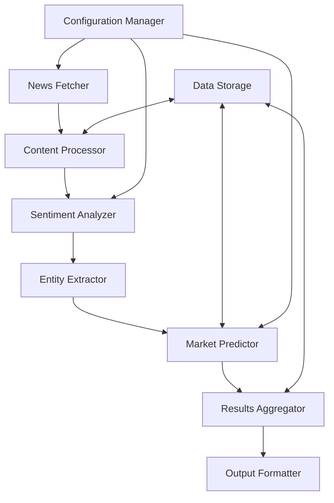

# News Market Predictor Design Document

## Overview

The News Market Predictor is a data pipeline system that automatically fetches Yahoo Finance news, analyzes content using natural language processing, and generates predictions about potential stock market impact. The system follows a modular architecture with clear separation between data collection, analysis, prediction, and presentation layers.

## Architecture

The system uses a pipeline architecture with the following main components:



**Key Architectural Principles:**
- **Modularity**: Each component has a single responsibility and can be tested independently
- **Fault Tolerance**: Components handle errors gracefully and continue processing
- **Scalability**: Pipeline can process multiple articles concurrently
- **Extensibility**: New analysis methods and prediction models can be easily added

## Components and Interfaces

### News Fetcher
- **Purpose**: Retrieves daily news articles from Yahoo Finance RSS feeds and web scraping
- **Input**: Configuration parameters (date range, categories)
- **Output**: Raw news articles with metadata
- **Key Methods**: `fetch_daily_news()`, `parse_article_content()`, `deduplicate_articles()`

### Content Processor
- **Purpose**: Cleans and normalizes article text for analysis
- **Input**: Raw news articles
- **Output**: Processed text with extracted metadata
- **Key Methods**: `clean_text()`, `extract_metadata()`, `validate_content()`

### Sentiment Analyzer
- **Purpose**: Analyzes emotional tone and market sentiment of news content
- **Input**: Processed article text
- **Output**: Sentiment scores and confidence metrics
- **Key Methods**: `analyze_sentiment()`, `calculate_confidence()`, `detect_market_tone()`

### Entity Extractor
- **Purpose**: Identifies stock symbols, company names, and financial metrics
- **Input**: Article text and metadata
- **Output**: Structured entities with relevance scores
- **Key Methods**: `extract_stock_symbols()`, `identify_companies()`, `find_financial_metrics()`

### Market Predictor
- **Purpose**: Generates impact predictions based on analysis results
- **Input**: Sentiment scores, extracted entities, historical data
- **Output**: Impact predictions with confidence levels
- **Key Methods**: `predict_impact()`, `calculate_confidence()`, `aggregate_signals()`

### Results Aggregator
- **Purpose**: Combines predictions for multiple stocks and time periods
- **Input**: Individual predictions and historical accuracy data
- **Output**: Aggregated predictions with weighted confidence
- **Key Methods**: `aggregate_predictions()`, `weight_by_confidence()`, `calculate_accuracy_metrics()`

## Data Models

### NewsArticle
```python
class NewsArticle:
    id: str
    title: str
    content: str
    url: str
    published_at: datetime
    source: str
    category: str
    raw_metadata: dict
```

### SentimentAnalysis
```python
class SentimentAnalysis:
    article_id: str
    sentiment_score: float  # -1.0 to 1.0
    confidence: float      # 0.0 to 1.0
    key_phrases: List[str]
    market_tone: str       # bullish, bearish, neutral
```

### ExtractedEntity
```python
class ExtractedEntity:
    article_id: str
    entity_type: str       # stock_symbol, company, metric
    entity_value: str
    relevance_score: float # 0.0 to 1.0
    context: str
```

### MarketPrediction
```python
class MarketPrediction:
    article_id: str
    stock_symbol: str
    impact_direction: str  # positive, negative, neutral
    impact_magnitude: float # 0.0 to 1.0
    confidence_level: float # 0.0 to 1.0
    reasoning: str
    created_at: datetime
```

## Correctness Properties

*A property is a characteristic or behavior that should hold true across all valid executions of a system-essentially, a formal statement about what the system should do. Properties serve as the bridge between human-readable specifications and machine-verifiable correctness guarantees.*

**Property 1: News collection time window compliance**
*For any* daily news collection run, all retrieved articles should have publication timestamps within the specified 24-hour window
**Validates: Requirements 1.1**

**Property 2: Article data extraction completeness**
*For any* valid news article input, the system should extract and populate all required fields (title, content, timestamp, stock symbols)
**Validates: Requirements 1.2**

**Property 3: Network retry behavior**
*For any* network failure scenario, the system should retry exactly three times with exponential backoff delays before giving up
**Validates: Requirements 1.3**

**Property 4: Duplicate article filtering**
*For any* set of articles containing duplicates, the deduplication process should remove articles with similar titles and content while preserving unique articles
**Validates: Requirements 1.4**

**Property 5: Article storage format consistency**
*For any* article processed and stored, retrieving it should return the same structured format with all original data intact
**Validates: Requirements 1.5**

**Property 6: Sentiment score bounds**
*For any* valid news article, the generated sentiment score should always be between -1.0 and 1.0 inclusive
**Validates: Requirements 2.1**

**Property 7: Entity extraction completeness**
*For any* article containing stock symbols or company names, the system should identify and extract all mentioned entities
**Validates: Requirements 2.2, 2.3**

**Property 8: Article categorization consistency**
*For any* processed article, the system should assign appropriate market sector tags based on content analysis
**Validates: Requirements 2.4**

**Property 9: Prediction format validation**
*For any* generated prediction, the impact direction should be one of: positive, negative, or neutral
**Validates: Requirements 3.1**

**Property 10: Confidence level calculation**
*For any* prediction, the confidence level should be between 0% and 100% and reflect historical accuracy and article characteristics
**Validates: Requirements 3.2**

**Property 11: Multi-stock prediction completeness**
*For any* article mentioning multiple stock symbols, separate predictions should be generated for each identified symbol
**Validates: Requirements 3.3**

**Property 12: Historical data incorporation**
*For any* prediction where similar historical news exists, the historical market reactions should influence the current prediction
**Validates: Requirements 3.4**

**Property 13: Low confidence flagging**
*For any* prediction with confidence below 30%, the system should flag it as low-confidence
**Validates: Requirements 3.5**

**Property 14: Display output completeness**
*For any* prediction display, all required fields (impact, confidence, stock symbols, article title) should be present
**Validates: Requirements 4.1, 4.2**

**Property 15: Accuracy calculation correctness**
*For any* 30-day historical period, the displayed accuracy rate should correctly reflect the percentage of accurate predictions
**Validates: Requirements 4.3**

**Property 16: Prediction aggregation consistency**
*For any* stock with multiple predictions, the aggregated result should properly weight individual predictions by their confidence scores
**Validates: Requirements 4.4**

**Property 17: Export format validation**
*For any* exported results, the data should be valid JSON or CSV format and parseable by external tools
**Validates: Requirements 4.5**

**Property 18: Error resilience**
*For any* malformed article in a batch, processing should continue for remaining valid articles while logging the error
**Validates: Requirements 5.1**

**Property 19: Rate limit handling**
*For any* API rate limit scenario, the system should implement appropriate delays and retry mechanisms
**Validates: Requirements 5.2**

**Property 20: Invalid input handling**
*For any* invalid input to prediction models, the system should return neutral predictions with appropriate error flags
**Validates: Requirements 5.3**

**Property 21: Storage failure recovery**
*For any* storage operation failure, the system should attempt backup storage and generate administrator alerts
**Validates: Requirements 5.4**

**Property 22: Resource prioritization**
*For any* low-resource scenario, high-impact news articles should be processed before lower-impact articles
**Validates: Requirements 5.5**

## Error Handling

The system implements comprehensive error handling at multiple levels:

### Network and API Errors
- **Connection failures**: Exponential backoff retry mechanism (3 attempts max)
- **Rate limiting**: Automatic delay calculation based on API response headers
- **Timeout handling**: Configurable timeouts with graceful degradation
- **Invalid responses**: Content validation with fallback to cached data when possible

### Data Processing Errors
- **Malformed content**: Skip individual articles while continuing batch processing
- **Parsing failures**: Log detailed error information and assign neutral sentiment scores
- **Missing data**: Use default values where appropriate, flag incomplete records
- **Encoding issues**: Automatic charset detection and conversion

### Prediction Model Errors
- **Invalid input**: Return neutral predictions with confidence flags
- **Model failures**: Fallback to simpler heuristic-based predictions
- **Resource constraints**: Implement processing prioritization and queuing
- **Confidence thresholds**: Flag low-confidence predictions for manual review

### Storage and Persistence Errors
- **Database failures**: Automatic failover to backup storage systems
- **Disk space issues**: Implement data rotation and cleanup policies
- **Corruption detection**: Data integrity checks with automatic recovery
- **Backup failures**: Multiple backup strategies with alerting

## Testing Strategy

The system employs a dual testing approach combining unit tests and property-based tests:

### Unit Testing Approach
- **Component isolation**: Test individual components with mocked dependencies
- **Edge case coverage**: Test boundary conditions, empty inputs, and error scenarios
- **Integration points**: Verify correct data flow between components
- **Error handling**: Validate error recovery and fallback mechanisms
- **Performance benchmarks**: Ensure processing meets latency requirements

### Property-Based Testing Approach
- **Framework**: Use Hypothesis (Python) for property-based testing with minimum 100 iterations per test
- **Universal properties**: Verify correctness properties hold across all valid inputs
- **Data generators**: Create smart generators for news articles, stock symbols, and market data
- **Invariant testing**: Ensure system invariants are maintained under all conditions
- **Regression prevention**: Catch edge cases that traditional unit tests might miss

### Test Tagging Requirements
- Each property-based test must include a comment with format: **Feature: news-market-predictor, Property {number}: {property_text}**
- Each test must explicitly reference the correctness property from this design document
- Tests should be co-located with source code using `.test.py` suffix
- Integration tests should verify end-to-end workflows with realistic data

### Test Data Strategy
- **Synthetic data**: Generate realistic news articles with known characteristics
- **Historical data**: Use past Yahoo Finance articles for regression testing
- **Edge cases**: Create articles with unusual formatting, missing data, and error conditions
- **Performance data**: Large datasets for load testing and performance validation

The testing strategy ensures both specific examples work correctly (unit tests) and general correctness properties hold across all inputs (property-based tests), providing comprehensive validation of system behavior.